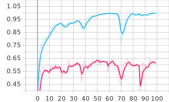

# Log

- 22-Aug: 
  - Explored some repositories and did some background study on hand writing extraction.

- 23-Aug: 
  - Progress of "chars in boxes" can be seen below:
  - 
    - Here position of vertical line is choosen randomly from gaussian distribution having mean as midpoint of char_spacing.
  - 
    - Here position of vertical line is choosen as midpoint of randomised char_spacing from gaussian distribution.
  - Trying to code such that the boxes are of fixed width.
  ___

  - 
    - Here width of boxes are fixed and assumed characters is written in center deterministically
  ___

  - 
    - Here width of boxes are fixed and assumed characters is written at center with error parameterised by gaussian distribution.
  
- 24-Aug: 
  - Written tfrecord_helper.py to manage operations of images abd labels generated in this code. 
  - Had a issue with eager_execution as bytes_list can't be converted to string in TFRecord. So written an generator-wrapper to solve this issue.
  ___
  - Carefully, handpicked 108 handwritten fonts to induce good amound of variance in the dataset. The variations include position, thickness etc.
  ___
  - Added apply_all_sides in Line.py to get borders on all sides. Included Line dropouts and padding.
  - Added 30 more fonts and removed some

- 25-Aug:
  - Generated sample dataset using 130+ hand-fonts.
  - Tested some sample with pre-trained models on IAM Dataset, the accuracy is very low. Almost, the ouput seems random.
  - Removed Light fonts. 
  - Adjusted data to the required format and trained the samples on https://github.com/githubharald/SimpleHTR repository.
  - It consists of 5 CNN layers, 2 RNN (LSTM) layers and the CTC loss and decoding layer.
  ___
  - Good progress is being seen in training this SimpleHTR on ~25k samples.
  - In, parallel working on other CRNN (https://github.com/MaybeShewill-CV/CRNN_Tensorflow) and converting data accordingly. 

- 26-Aug:
  - Written shell scripts for converting the annotation formats.
  - Encountered few errors with Tf 1.15, those issues were addressed with some tweaks in tensorflow git issues. It doesn't feel lasting and good implemention in tf v1.
  - I then used another git repo (ps://github.com/FLming/CRNN.tf2) modified it accordingly.
  ___
  - Trained CRNN model with tf2 with 80 epochs consisting of 95-5 split of ~50k images.
  - The complete tensorboard logs are uploaded in git.
  - After 30-40 epochs the model saturated
  - From the logs, it is evident that LSTMs didn't learn much. Hence, It didn't rely much on context,this might be due to randomly generated characters in words.
  - CNNs,BNs learnt well. The catch here is, it is more of a Computer Vision problem rather than NLP centric.
  ___
  - Choosen width of input image from analysing the distribution plot of training set.
     
  - To handle outliers of width and height added zero padding when required while resizing to retain aspect ratio of image
  - Trained Public dataset on pre-trained weights (trained ~50k images)
  - The model is overfitting after val_loss (CTC loss) reaching ~6 and val_accuracy (60-65%) on public dataset
    
    - CTC loss
    
    - Word_Accuracy
  - Currently tuning hyper parameters for better results. 
  

- 27-Aug:
  - Modifyied model architecture after analysing the tensorboard.
  - Generated another ~50k synthetic images to train the model.
  - Tuning hyper parameters.
  - Implemented flask app on heroku with dummy_detect function.

- 28-Aug:
  - Tuned Hyper Params.
  - Re-modified custom architecture, results weren't favourable.
  - Due to memory constraints in heroku (500 Mb), Compressed the model from hdf5 to savedmodel
  - Had issue with Functional Models while conversion in tf2.2, so upgraded to tf2.3 (as of Colab)
  - Though the compressed slug size was 476 Mb which eventually blew up to ~800Mb while running dyno in heroku cloud.
  - Ran heroku app locally successfully.

- 29-Aug:
  - Successfully built model on CRNN with deployment.
  - Started implemeting Attention mechanism.
  - Qualitatively gave a good result on pre-trained model.
  - Quantative analysis on metrics are being done.

- 30-Aug:
  - Successfuflly implemented and trained on Attention-based OCR.
  - The results are much better.
  - Changed loss function from CTC lo ACE, after studying (https://openaccess.thecvf.com/content_CVPR_2019/papers/Xie_Aggregation_Cross-Entropy_for_Sequence_Recognition_CVPR_2019_paper.pdf)
  - Lot of changes made in code to fit in deployment.
  - Trying to modify depricated packages from TF1 
